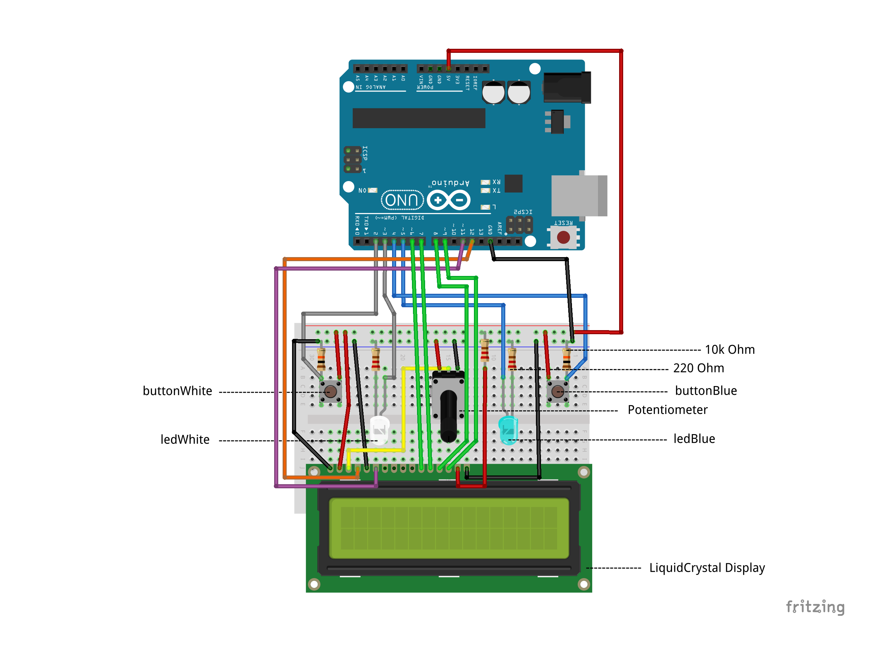
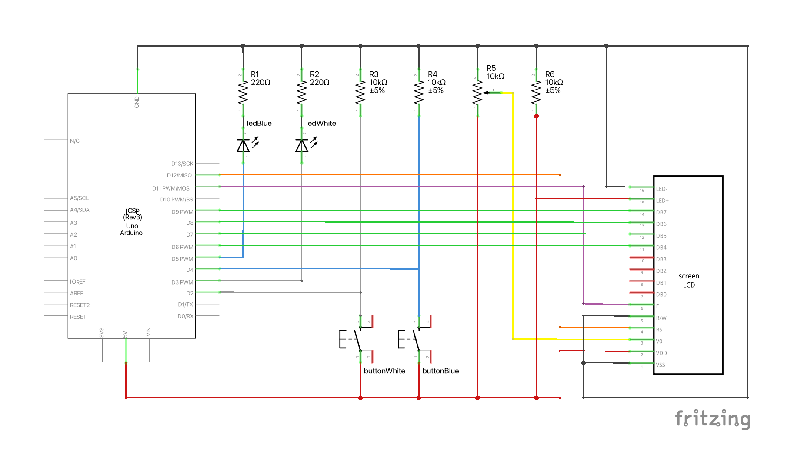

# Arduino Table Tennis Counter

This table tennis counter was implemented using the [Arduino Starter Kit](https://store.arduino.cc/products/arduino-starter-kit-multi-language?queryID=undefined).

## Requirements
The following items are necessary to build the table tennis counter:
- 1 Arduino Microcontroller
- 1 Breadboard
- 2 LEDs
- 2 Buttons
- 1 10k Ω Potentiometer
- 2 220 Ω Resistors
- 3 10k Ω Resistors
- Wires
- 1 USB Cable
- [tabletennis.ino](tabletennis.ino)

## Logic
The logical sequence is explained as follows:

- The teams first play for the initial serve.
- When a team wins the first ball exchange, the button is clicked for that team and the team's LED turns on (counter doesn't start yet). The button for a team is pressed whenever that team scores a point.
- The team's LED stays on until the team has completed two serves (i.e. two points have been scored, regardless of the team). The LEDs alternate every two points (regardless of which team scored).
- The game ends when a team reaches 11 points and has at least two more points than the other team.
- At the end of the game, the reset button on the microcontroller can be used to reset the game.

## Breadboard Wirering

## Scheme

